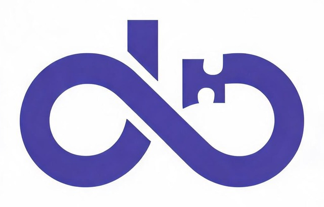
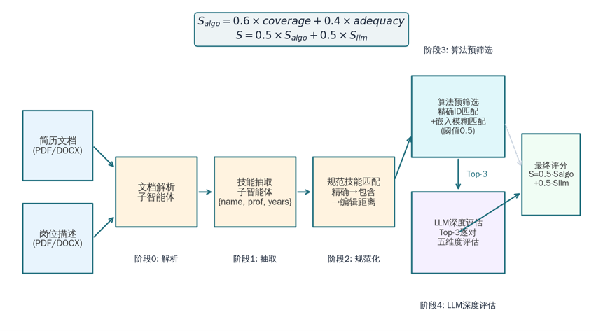
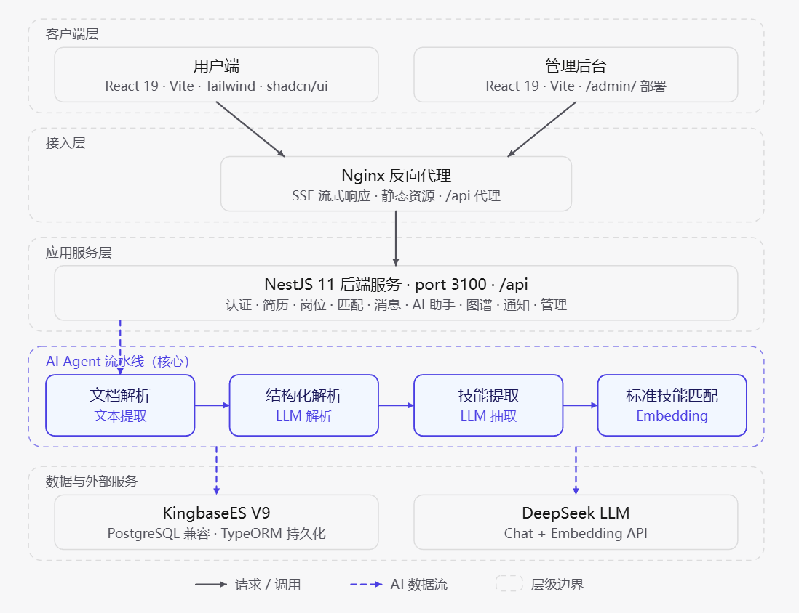
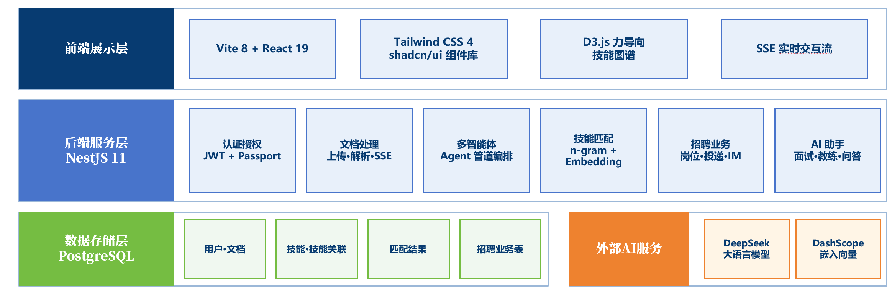
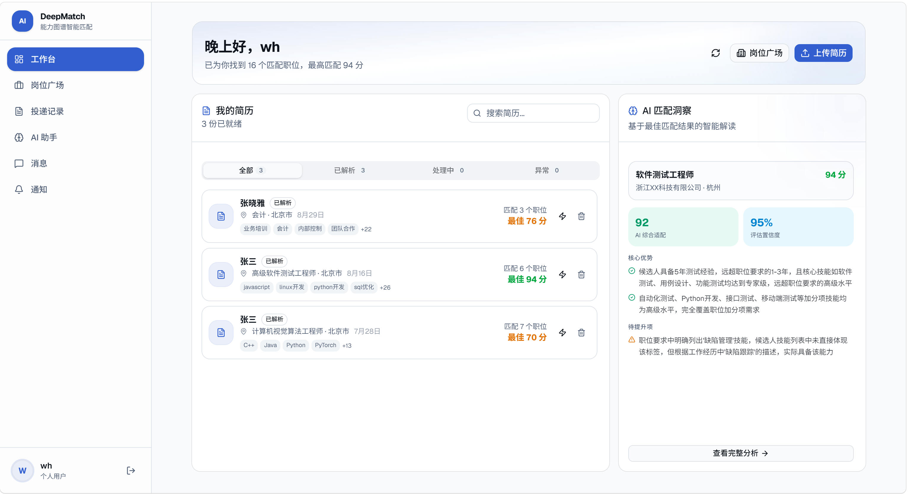
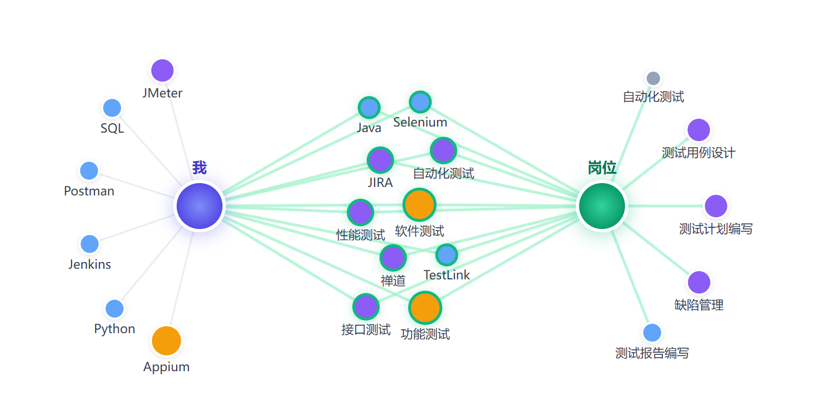
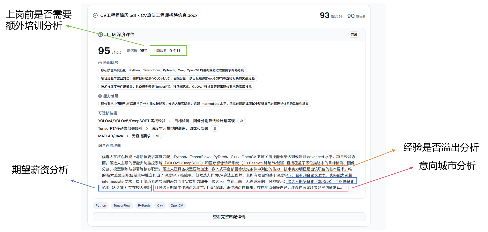
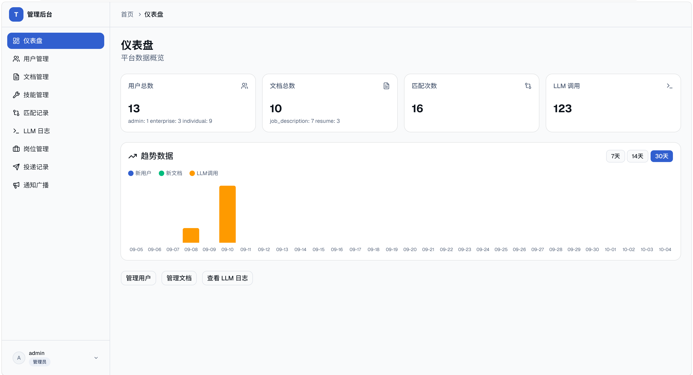
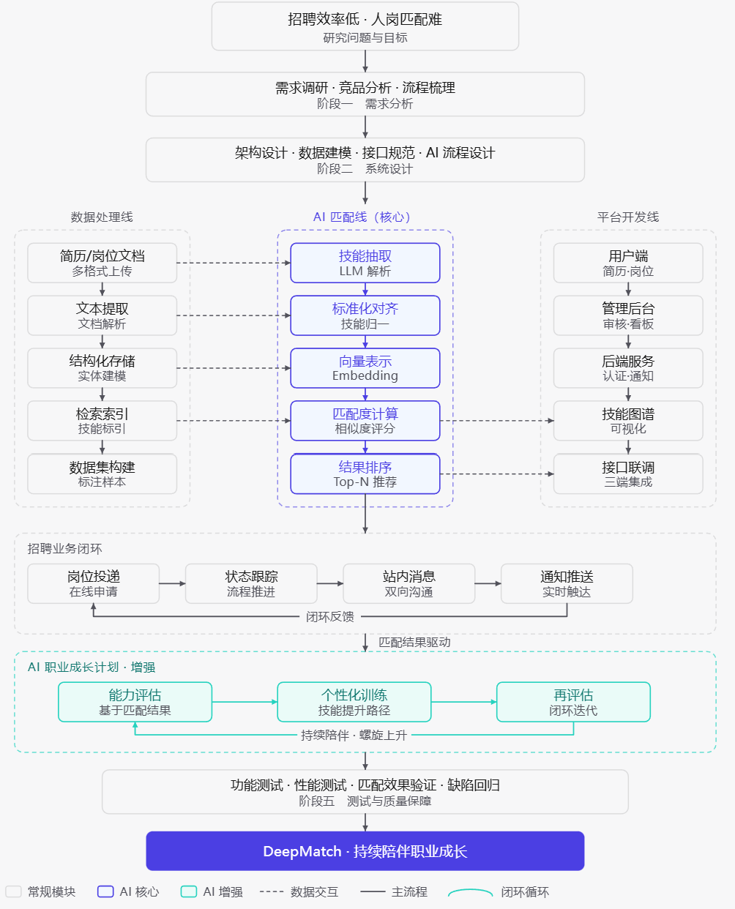

<p align="center">
  
</p>

<h3 align="center">An AI recruiting system built on deep semantic understanding and skill-knowledge modeling</h3>

<p align="center">
  <a href="README.md"><b>English</b></a> | <a href="README.zh-CN.md">简体中文</a>
</p>

<p align="center">
  
  
  
  
</p>

---

DeepMatch parses resumes and job descriptions into structured skills, builds a standardized skill library and a visualizable skill graph, and then matches talent with jobs **bidirectionally** using LLM semantic scoring plus embedding-based vector similarity.

## Core Pipeline



| Stage | What happens |
|-------|--------------|
| Stage 0 · Parsing | Text extraction from resumes / job descriptions (PDF, DOCX) |
| Stage 1 · Extraction | The skill-extraction sub-agent emits `{name, prof, years}` |
| Stage 2 · Normalization | Exact match → containment match → edit distance, mapped onto the standard skill library |
| Stage 3 · Algorithmic pre-filter | Exact ID match + fuzzy embedding match (threshold 0.5), producing Top-3 candidates |
| Stage 4 · LLM deep evaluation | Pairwise five-dimension evaluation of the Top-3 candidates, fused into the final score |

Two scoring formulas:

```
S_algo = 0.6 × coverage + 0.4 × adequacy      # algorithmic score: coverage + adequacy
S      = 0.5 × S_algo + 0.5 × S_llm           # final score: algorithmic and LLM scores weigh equally
```

## Architecture



Reading bottom-up: `KingbaseES V9 / PostgreSQL` for persistence → `NestJS 11` application services (auth, resumes, jobs, matching, messaging, AI assistant, graph, notifications, admin) → `Nginx` reverse proxy (SSE streaming, static assets, `/api`) → the two frontends. The dashed box on the left is the **AI Agent pipeline** that runs through the whole flow.

### Layered Tech Stack



### Screenshots

| Candidate workspace | Skill graph visualization |
|---|---|
|  |  |

**Matching insights** — the LLM returns explainable conclusions across strengths, capability gaps, transferable skills, expected salary and preferred city:



**Admin console** — users / documents / skills / match records / LLM logs / jobs / applications / broadcast notifications:



## Repository Layout

| Path | Description | Default port |
|------|-------------|--------------|
| [`backend/`](backend/) | NestJS 11 + TypeScript + TypeORM + PostgreSQL REST API (global prefix `/api`) | 3100 |
| [`frontend/`](frontend/) | React 19 + Vite 8 + Tailwind CSS 4 + shadcn/ui, candidate-facing app | 3000 |
| [`backend-management/`](backend-management/) | React 19 + Vite 8 admin console, production `base` is `/admin/` | 3001 |
| [`images/`](images/) | Diagrams and screenshots used in this README | — |
| [`README.zh-CN.md`](README.zh-CN.md) | Chinese version of this document | — |
| `sql/public.sql` | Database schema snapshot (exported from PostgreSQL 18, **DDL only, no data**) | — |

## Features

**Candidate app (`frontend`)**

- Resume upload and parsing (PDF / DOCX), LLM skill extraction and normalization
- Job posting, browsing, search and applications
- Bidirectional matching: scores, multi-dimension comparison, skill-graph visualization (D3 force layout)
- AI assistant chat (SSE streaming), in-app messages and notifications

**Admin console (`backend-management`)**

| Page | Capabilities |
|------|--------------|
| Dashboard | User / document / match / LLM-call statistics and trend chart |
| Users | Search, filter, paginate, enable/disable, delete (admin protected) |
| Documents | Parsed-text detail, re-parse, delete |
| Skills | Category statistics, structural-break / low-frequency skill flags |
| Match records | Score filtering, side-by-side match detail |
| Jobs | Platform-wide job list, status changes, detail view |
| Applications | Platform-wide application queries with status history |
| LLM logs | Call statistics, prompt / response retention |
| Broadcast | Push system notifications to all users |

**Backend (`backend`)**

14 modules — `auth` `user` `document` `skill` `job` `application` `matching` `graph` `llm` `ai-assistant` `message` `notification` `admin` `dashboard` — including:

- **Automatic fallback to a secondary model** when the primary one fails (DeepSeek → Qwen / DashScope compatible mode)
- Embedding-based semantic similarity; degrades to plain string matching when no embedding key is configured
- LLM call logs and admin audit logs
- TypeORM migrations (`synchronize: false`), 5 migration scripts

## Tech Stack

| Concern | Backend | Frontend / Admin |
|---------|---------|------------------|
| Framework | NestJS 11 | React 19 + TypeScript |
| Build | Nest CLI / tsc | Vite 8 |
| Database | PostgreSQL + TypeORM 0.3 | — |
| Styling | — | Tailwind CSS 4 + shadcn/ui |
| Routing | — | React Router v7 |
| Visualization | d3-force (server-side layout) | D3.js |
| Auth | JWT + Passport | localStorage token |
| Document parsing | pdf-parse + mammoth | — |
| LLM | DeepSeek (primary) / DashScope (embeddings, fallback) | — |

## Requirements

- **Node.js ≥ 20.19** (Vite 8 requires `^20.19.0 || >=22.12.0`; NestJS 11 requires ≥ 20)
- **PostgreSQL** (the schema snapshot was exported from 18.x; 14+ generally works. KingbaseES's PostgreSQL-compatible mode is also supported)
- **LLM API keys** (bring your own):
  - DeepSeek — primary model for document parsing, skill extraction and semantic matching
  - Alibaba Cloud DashScope — embeddings, and the fallback model when the primary is unavailable

## Getting Started

### 1. Prepare the database

```bash
# create the database
psql -U postgres -c "CREATE DATABASE talent_match;"

# Option A: import the schema snapshot (DDL only)
psql -U postgres -d talent_match -f sql/public.sql

# Option B: run TypeORM migrations
cd backend && npm run migration:run
```

> Pick either option. On startup the backend seeds the `skill` table with about 2,335 standard
> skill names from `backend/data/entity_map/skill.list`.

### 2. Start the backend

```bash
cd backend
npm install
cp .env.example .env      # at minimum: DB_PASSWORD, JWT_SECRET, LLM_API_KEY, EMBEDDING_API_KEY
npm run start:dev         # http://localhost:3100/api
```

### 3. Start the candidate app

```bash
cd frontend
npm install
npm run dev               # http://localhost:3000
```

### 4. Start the admin console

```bash
cd backend-management
npm install
npm run dev               # http://localhost:3001
```

### 5. How the three processes relate

In development both frontends proxy `/api` to `http://localhost:3100` through Vite, so start the backend first.

## Configuration

Every environment variable read by the backend is documented in [`backend/.env.example`](backend/.env.example). Key ones:

| Variable | Required | Default | Notes |
|----------|----------|---------|-------|
| `PORT` | No | `3100` | HTTP port (global prefix `/api`) |
| `DB_HOST` / `DB_PORT` | No | `localhost` / `5432` | PostgreSQL connection |
| `DB_USERNAME` / `DB_PASSWORD` / `DB_DATABASE` | Yes | `postgres` / — / `talent_match` | Database credentials |
| `JWT_SECRET` | **Yes** | — | The backend **refuses to start** without it |
| `LLM_API_KEY` / `LLM_BASE_URL` / `LLM_MODEL` | Yes | — / `https://api.deepseek.com` | Primary model |
| `LLM_FALLBACK_API_KEY` / `LLM_FALLBACK_MODEL` | No | — | Secondary model (automatic failover) |
| `EMBEDDING_API_KEY` | No | — | Alibaba Cloud DashScope; without it matching degrades to string matching |
| `ENTITY_MAP_DIR` | No | `backend/data/entity_map` | Skill seed data directory |

> Neither frontend reads environment variables: in development the API base is fixed by the Vite proxy
> (`/api` → `http://localhost:3100`); in production let Nginx or another reverse proxy forward `/api`.

## Common Commands

| Directory | Dev | Build | Checks |
|-----------|-----|-------|--------|
| `backend/` | `npm run start:dev` | `npm run build` → `npm run start:prod` | `npm run lint` / `npm test` / `npm run test:e2e` |
| `frontend/` | `npm run dev` | `npm run build` | `npm run lint` |
| `backend-management/` | `npm run dev` | `npm run build` | `npm run lint` |

Database migrations (inside `backend/`):

```bash
npm run migration:run       # apply migrations
npm run migration:revert    # revert the latest one
npm run migration:generate  # generate a migration from entity diffs
```

## Roadmap

Three parallel tracks starting from the research question (data processing / AI matching / platform engineering), converging on a closed recruiting loop and an AI career-growth plan:



## Data & Privacy

- This repository contains **no real resumes or personal data**; all documents and users are fictional demo data.
  The screenshots in this README were captured in a demo environment.
- Resumes are sensitive personal data. Before running this in production, complete your data-compliance and
  privacy review, and never use real resumes for public demos.
- Uploaded files live in `backend/uploads/` (git-ignored). Do not commit them.

## License

This project **does not ship a `LICENSE` file yet** (to be added). Until then, all rights are reserved.
