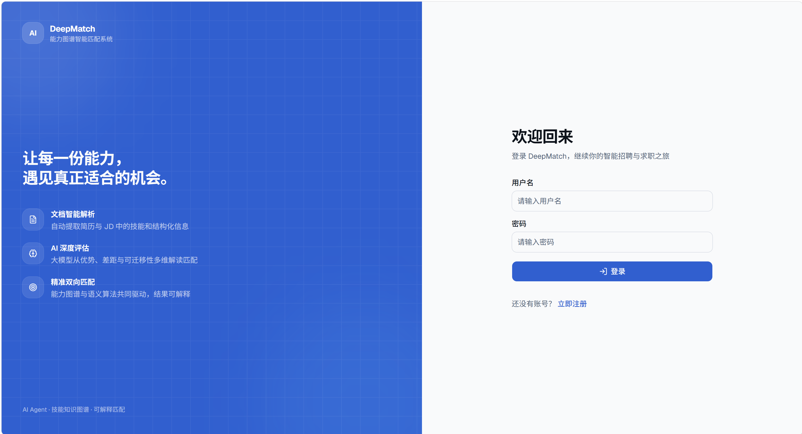

<p align="center">
  
</p>

<h3 align="center">基于深度语义理解与技能知识建模的 AI 招聘系统</h3>

<p align="center">
  <a href="README.md">English</a> | <b>简体中文</b>
</p>

<p align="center">
  
  
  
  
</p>

---

系统把简历与岗位文档解析为结构化技能，构建标准技能库与可视化能力图谱，再通过大模型语义打分 + Embedding 向量相似度完成人才与岗位的**双向匹配**。

## 核心流程


| 阶段 | 做什么 |
|------|--------|
| 阶段 0 · 解析 | 简历 / 岗位描述（PDF、DOCX）文本提取 |
| 阶段 1 · 抽取 | 技能抽取子智能体输出 `{name, prof, years}` |
| 阶段 2 · 规范化 | 技能精确匹配 → 包含匹配 → 编辑距离，归一到标准技能库 |
| 阶段 3 · 算法预筛选 | 精确 ID 匹配 + 嵌入模糊匹配（阈值 0.5），产出 Top-3 候选 |
| 阶段 4 · LLM 深度评估 | 对 Top-3 逐对做五维评估，融合出最终分数 |

两段打分公式：

```
S_algo = 0.6 × coverage + 0.4 × adequacy      # 算法分：覆盖率 + 充分度
S      = 0.5 × S_algo + 0.5 × S_llm           # 最终分：算法分与 LLM 分各占一半
```

## 系统架构


从下往上看：`KingbaseES V9 / PostgreSQL` 持久化 → `NestJS 11` 应用服务（认证、简历、岗位、匹配、消息、AI 助手、图谱、通知、管理）
→ `Nginx` 反向代理（SSE 流式响应、静态资源、`/api` 代理）→ 两端前端；左侧虚线框是贯穿全流程的 **AI Agent 流水线**。

### 分层技术栈


### 界面预览

**登录页**——"让每一份能力，遇见真正适合的机会。"



| 用户端工作台 | 能力图谱可视化 |
|---|---|
|  |  |

**匹配结果洞察**——大模型在匹配优势、能力差距、可迁移技能、期望薪资、意向城市等维度给出可解释结论：


**管理后台**——用户 / 文档 / 技能 / 匹配记录 / LLM 日志 / 岗位 / 投递 / 通知广播：


## 目录结构

| 目录 | 说明 | 默认端口 |
|------|------|----------|
| [`backend/`](backend/) | NestJS 11 + TypeScript + TypeORM + PostgreSQL，REST API（全局前缀 `/api`） | 3100 |
| [`frontend/`](frontend/) | React 19 + Vite 8 + Tailwind CSS 4 + shadcn/ui，用户端 | 3000 |
| [`backend-management/`](backend-management/) | React 19 + Vite 8 管理后台，生产构建 `base` 为 `/admin/` | 3001 |
| [`images/`](images/) | README 中的架构图与界面截图 | — |
| [`README.md`](README.md) | 英文版说明（GitHub 默认展示） | — |
| `sql/public.sql` | 数据库结构快照（PostgreSQL 18 导出，**纯 DDL、不含数据**） | — |

## 功能概览

**用户端（frontend）**

- 简历上传与解析（PDF / DOCX）、LLM 技能提取与标准化
- 岗位发布、浏览、检索与投递
- 双向匹配：匹配分数、多维能力对比、能力图谱可视化（D3 力导向图）
- AI 助手对话（SSE 流式输出）、站内消息与通知

**管理后台（backend-management）**

| 页面 | 功能 |
|------|------|
| 仪表盘 | 用户 / 文档 / 匹配 / LLM 调用统计与趋势图 |
| 用户管理 | 搜索筛选分页、启用禁用、删除（含管理员保护） |
| 文档管理 | 解析文本详情、重新解析、删除 |
| 技能管理 | 分类统计、结构断裂 / 低频技能标记 |
| 匹配记录 | 分数筛选、匹配详情对比视图 |
| 岗位管理 | 全平台岗位列表、状态变更、详情查看 |
| 投递记录 | 全平台投递查询与状态流转历史 |
| LLM 日志 | 调用统计、Prompt / Response 留痕 |
| 通知广播 | 向全体用户推送系统通知 |

**后端能力（backend）**

`auth` `user` `document` `skill` `job` `application` `matching` `graph` `llm` `ai-assistant` `message` `notification` `admin` `dashboard` 共 14 个模块，包含：

- 主模型不可用时**自动切换备用模型**（DeepSeek → Qwen / DashScope 兼容模式）
- Embedding 语义相似度匹配；未配置 Embedding Key 时自动降级为字符串匹配
- LLM 调用日志与管理员审计日志
- TypeORM 迁移（`synchronize: false`），5 个迁移脚本

## 技术栈

| 类别 | 后端 | 用户端 / 管理后台 |
|------|------|-------------------|
| 框架 | NestJS 11 | React 19 + TypeScript |
| 构建 | Nest CLI / tsc | Vite 8 |
| 数据库 | PostgreSQL + TypeORM 0.3 | — |
| 样式 | — | Tailwind CSS 4 + shadcn/ui |
| 路由 | — | React Router v7 |
| 可视化 | d3-force（服务端布局计算） | D3.js |
| 认证 | JWT + Passport | localStorage Token |
| 文档解析 | pdf-parse + mammoth | — |
| 大模型 | DeepSeek（主）/ DashScope（Embedding、备用） | — |

## 环境要求

- **Node.js ≥ 20.19**（Vite 8 要求 `^20.19.0 || >=22.12.0`，NestJS 11 要求 ≥ 20）
- **PostgreSQL**（结构快照由 18.x 导出，14+ 通常可用；兼容人大金仓 KingbaseES 的 postgres 驱动模式）
- **大模型 API Key**（需自行申请）：
  - DeepSeek —— 主模型，用于文档解析、技能提取、语义匹配
  - 阿里云 DashScope —— Embedding 向量，以及主模型不可用时的备用模型

## 快速开始

### 1. 准备数据库

```bash
# 创建数据库
psql -U postgres -c "CREATE DATABASE talent_match;"

# 方式一：导入结构快照（纯 DDL）
psql -U postgres -d talent_match -f sql/public.sql

# 方式二：执行 TypeORM 迁移
cd backend && npm run migration:run
```

> 两种方式二选一即可。系统启动时会自动把 `backend/data/entity_map/skill.list`
> 中的约 2,335 条标准技能名导入 `skill` 表作为技能库种子。

### 2. 启动后端

```bash
cd backend
npm install
cp .env.example .env      # 至少填写 DB_PASSWORD、JWT_SECRET、LLM_API_KEY、EMBEDDING_API_KEY
npm run start:dev         # http://localhost:3100/api
```

### 3. 启动用户端

```bash
cd frontend
npm install
npm run dev               # http://localhost:3000
```

### 4. 启动管理后台

```bash
cd backend-management
npm install
npm run dev               # http://localhost:3001
```

### 5. 三个进程的关系

用户端与管理后台在开发环境下都由 Vite 把 `/api` 代理到 `http://localhost:3100`，
因此**先启动后端**再访问前端页面。

## 配置说明

后端读取的全部环境变量见 [`backend/.env.example`](backend/.env.example)。关键项：

| 变量 | 必填 | 默认值 | 说明 |
|------|------|--------|------|
| `PORT` | 否 | `3100` | HTTP 监听端口（全局前缀 `/api`） |
| `DB_HOST` / `DB_PORT` | 否 | `localhost` / `5432` | PostgreSQL 连接地址 |
| `DB_USERNAME` / `DB_PASSWORD` / `DB_DATABASE` | 是 | `postgres` / — / `talent_match` | 数据库账号 |
| `JWT_SECRET` | **是** | — | 未配置时后端**启动即报错退出** |
| `LLM_API_KEY` / `LLM_BASE_URL` / `LLM_MODEL` | 是 | — / `https://api.deepseek.com` | 主模型 |
| `LLM_FALLBACK_API_KEY` / `LLM_FALLBACK_MODEL` | 否 | — | 备用模型（主模型失败时自动切换） |
| `EMBEDDING_API_KEY` | 否 | — | 阿里云 DashScope；不配置则降级为字符串匹配 |
| `ENTITY_MAP_DIR` | 否 | `backend/data/entity_map` | 技能种子数据目录 |

> 用户端与管理后台**不读取环境变量**：开发环境的 API 地址固定为 Vite 代理
> `/api` → `http://localhost:3100`，生产环境请由 Nginx 等反向代理层转发 `/api`。

## 常用命令

| 目录 | 开发 | 构建 | 检查 |
|------|------|------|------|
| `backend/` | `npm run start:dev` | `npm run build` → `npm run start:prod` | `npm run lint` / `npm test` / `npm run test:e2e` |
| `frontend/` | `npm run dev` | `npm run build` | `npm run lint` |
| `backend-management/` | `npm run dev` | `npm run build` | `npm run lint` |

数据库迁移（在 `backend/` 下）：

```bash
npm run migration:run       # 执行迁移
npm run migration:revert    # 回滚最近一次
npm run migration:generate  # 依据实体差异生成迁移
```

## 项目路线

从研究问题出发的三条并行主线（数据处理 / AI 匹配 / 平台开发），收敛到招聘业务闭环与 AI 职业成长计划：


## 数据与隐私说明

- 本仓库**不包含任何真实简历或个人信息**，文档与用户均为虚构的演示数据；
  README 中的界面截图取自演示环境。
- 招聘场景下的简历属于个人敏感信息。若用于生产环境，请先完成数据合规与隐私评估，
  不要用真实简历做公开演示。
- 上传的文件保存在 `backend/uploads/`（已在 `.gitignore` 中忽略），请勿提交到版本库。

## 许可证

本项目**尚未添加 `LICENSE` 文件**（待补充）。在补充之前，默认保留所有权利。
